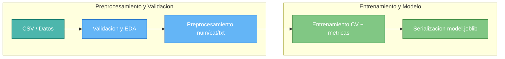

# Telco Churn – Proyecto End-to-End (EDA ➜ Modelo ➜ App ➜ Deploy temporal)

Este repositorio muestra un caso completo de **predicción de churn en telecomunicaciones**:
- **Dataset** (sintético/limpio): comportamiento de clientes, uso del servicio y bajas.
- **Notebook de Colab**: EDA, preprocesamiento, modelado (LogisticRegression/RandomForest), métricas y serialización.
- **App Streamlit (`app.py`)**: formulario con las mismas features del entrenamiento, probabilidad y decisión con **umbral ajustable**, y recomendaciones de negocio.
- **Deploy temporal con ngrok**: publicación rápida desde Colab.

---

## 1. Problema de negocio
Reducir el **churn** prediciendo qué clientes tienen mayor probabilidad de darse de baja y habilitar acciones de retención (ofertas, mejoras de servicio, etc.).  
**KPI**: F1 / AUC (clasificación binaria), tasa de retención.

---

## 2. Datos
- ~1.5k filas, ~19 columnas (numéricas, categóricas, fechas y texto corto `nps_text`).
- Imperfecciones controladas: nulos, outliers, categorías raras.
- Target balanceado (≈40–60%).
- Features derivadas: `days_since_signup`, `days_since_last_interaction`.

> Si no incluyes el CSV aquí, el notebook puede **generarlo** o bien cargar desde un archivo subido en Colab.

---

## 3. Arquitectura (alto nivel)



---

## 4. Instalación y entorno

Se recomienda trabajar en un **entorno virtual** (Conda o venv).

### Opción 1 – Usando Conda
```bash
# Crear y activar entorno
conda create -n telcochurn python=3.10 -y
conda activate telcochurn

# Instalar dependencias
pip install -r requirements.txt
```

### Opción 2 – Usando venv
```bash
# Crear y activar entorno
python -m venv .venv
source .venv/bin/activate   # Mac/Linux
.venv\Scripts\activate      # Windows

# Instalar dependencias
pip install -r requirements.txt
```
